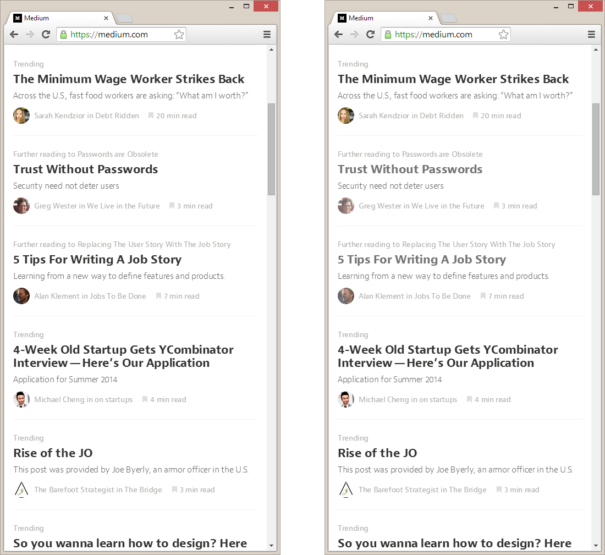
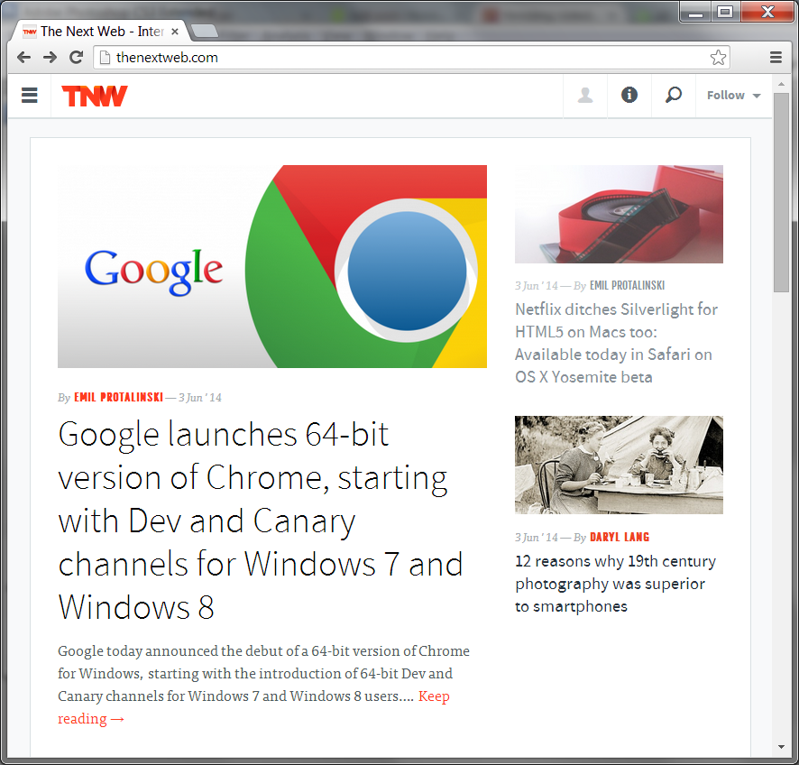

It's easier to decide where you want to go if you know where you've been.

Sounds like the start of some awful seminar on how to improve your life. It isn't. It's a principle of digital design that seems to have been forgotten. This is a reminder to designers out there.

---

By default, browsers show links to already visited pages in a different colour. They're purple. They actually feel used. A great feature, because people scan pages for things they want to read, skipping what they don't. It's one of those details that can unconsciously delight your users.

And it's a detail that gets thrown away by a lot of designers. One colour for all links seems to be enough, but it's not. Let me show you why.

### On Medium

[Medium](http://medium.com) is one of the best designed sites out there. The design is deceivingly simple, but every pixel is considered. However, they do not show visited articles in a different colour, and I think they should.

Let's look at a side-by-side comparison of their current design and a mockup I made.

 

On the left, I can't tell which article I've opened. On the right, I can clearly see I've read the second and third article. When I look for articles I want to read next, the right image makes more sense.

### On TheNextWeb

Sites that use images as links can apply the same principle. Let's take a look at [TheNextWeb](http://thenextweb.com/), a news site about technology.

First, the site as they designed it. They do not distinguish visited links from other links.

 

Again, this page can benefit from the visited links principle. A quick mockup results in something like this:

 

A clear improvement, I believe.

Note: I use these two sites as an example because they were just the first ones that came to mind. I don't know what their considerations for not using this feature were; perhaps they had good reasons.

---

If you're a designer and in charge of a website, consider adding this important detail. It takes just a few minutes and a few lines of CSS to implement. Be the start of a better web.
